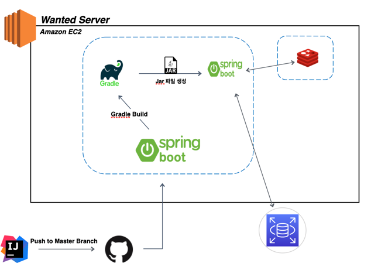
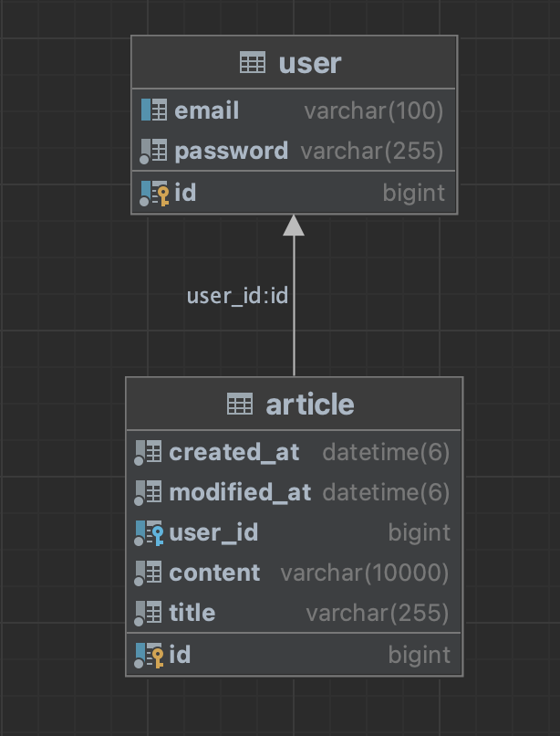

# wanted-pre-onboarding-backend

지원자: 이창희 
# 애플리케이션의 실행 방법 (엔드포인트 호출 방법 포함)
aws의 배포해놓은 서비스라 postMan이나 API호출 서비스가 가능한 것으로 호출하시면 됩니다.

- aws 서버 port : https://3.38.6.168
- 엔드포인트 호출은 API 명세서 참고

# Architecture

# 데이터베이스 테이블 구조

# 구현한 API의 동작을 촬영한 데모 영상 링크
- [데모 영상](https://drive.google.com/drive/folders/1tjkrdk3oW0WbjyoNhKOSoWc1k4TrlBug?usp=sharing)
# 구현 방법 및 이유에 대한 간략한 설명
- 클라이언트와의 효율적인 통신을 위해 RESTful 웹 서비스를 제공하도록 구현하였습니다.
- 각각의 엔드포인트를 통해 CRUD (Create, Read, Update, Delete) 작업을 수행할 수 있습니다.
- redis DB를 통한 회원인증을 하였습니다. redis는 인메모리DB여서 디스크 기반 DB보다 빠른속도를 보장하여 JWT관련 로직을 보다 빠르게   처리할 수 있습니다.

# API 명세(request/response 포함)
- [API 명세서](https://documenter.getpostman.com/view/17635071/2s9Xy6rqJf)
